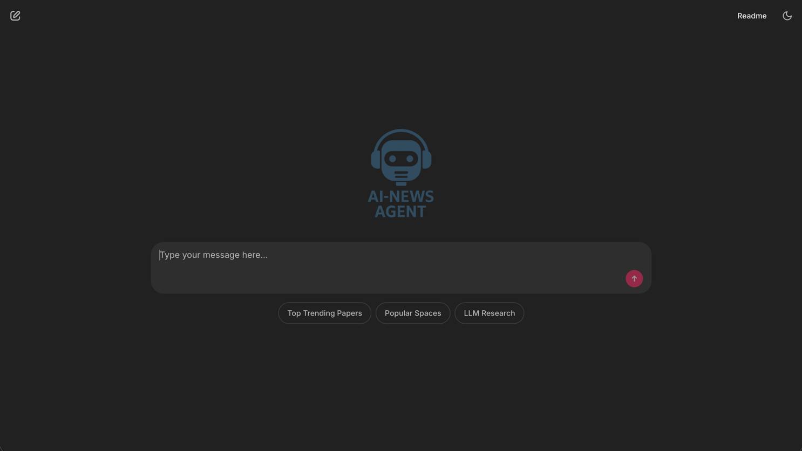
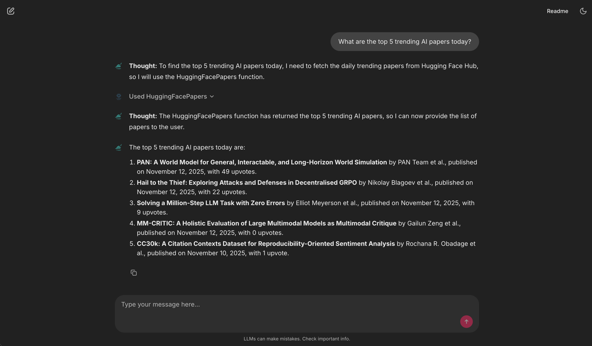

# AI-News Agent

An AI-powered assistant for discovering the latest AI/ML research papers and interactive demos from Hugging Face.



## Quick Start

### Installation
```bash
make install
```

### Run
```bash
make run
```

Or using uv directly:
```bash
uv run chainlit run main.py -w
```

### Environment Setup
Copy `.env.example` to `.env` and configure:
```bash
OPENAI_CHAT_MODEL=gpt-4
OPENAI_API_KEY=your_api_key_here
OPENAI_API_BASE=https://api.openai.com/v1
```

## Features

- **Trending AI Papers** - Daily trending research from Hugging Face with AI-generated summaries
- **Popular Spaces** - Interactive demos and applications from the community
- **Smart Reasoning** - Powered by BeeAI Framework's ReActAgent architecture



## Development

```bash
make format    # Format code with Black
make lint      # Run Pylint
make clean     # Remove cache files
```

## License

This project is licensed under the MIT License - see the [LICENSE](LICENSE) file for details.